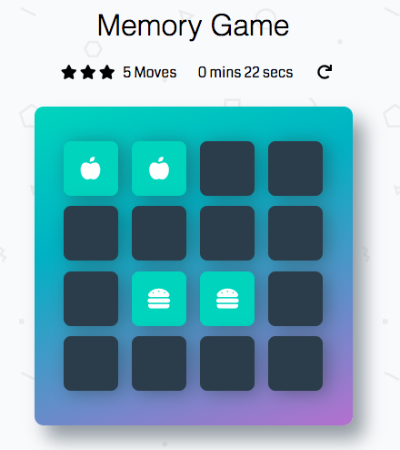

# Memory Game 

This is a classic memory or matching game. The game board consists of 16 cards arranged randomly. The deck is made of 8 different pairs of cards, each with different hidden symbols that can be revealed by flipping over and locating the ones that match. 

Additional features include: star-rating, timer, a moves-counter and a reset button. 



## Table of Contents

* [Installation](#installation) 
* [Built With](#built-with)
* [How to Play](#how-to-play)
* [Authors](#authors)
* [Acknowledgments](#acknowledgments)
* [Contributing](#contributing)

## Installation 

To install the memory game locally, clone the Github repository: 
```
$ git clone https://github.com/deboragaleano/memory-game.git
```
To preview the `index.html` (using the GitHub & BitBucket HTML Preview) please click here: [Memory Game](http://htmlpreview.github.io/?https://github.com/deboragaleano/memory-game/blob/master/index.html).

## Built With

* Vanilla JavaScript, HTML and CSS
* *Dependencies*: 
    * [Font Awesome](https://fontawesome.com/): Used for symbols  
    * [Animate.css](https://daneden.github.io/animate.css/): Used for CSS Animation 

## How To Play 

* Flip two cards over to reveal its symbol and try finding the corresponding card with the same symbol  
* If the cards match, both cards stay flipped over 
* If they don't, the cards are flipped face down
* The game ends once all 16 cards have been matched 
* A modal box will display the score (time, rating and the number of moves) along with a play again button 

## Authors

* **Udacity** - This repository included a starter code for all Udacity students. 
* **Debora Galeano** - Game logic, actions, additional features and styling 

## Acknowledgments

* Shuffle function: [Stack Overflow](http://stackoverflow.com/a/2450976). 
* Knowledge Udacity / Student's forum: For their assistance with creating the deck and the timer/reset function 
* Udacity [Webinar](https://www.youtube.com/watch?time_continue=935&v=x47oLiTpIVk): For the game logic reference

## Contributing

For details, check out [CONTRIBUTING.md](CONTRIBUTING.md).
